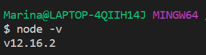
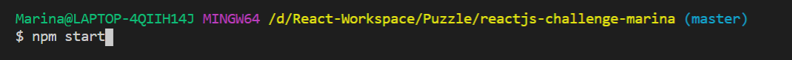
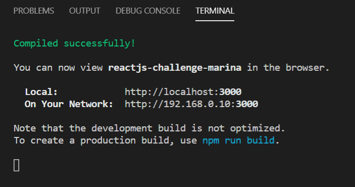
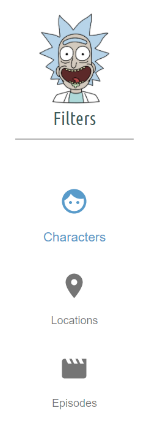
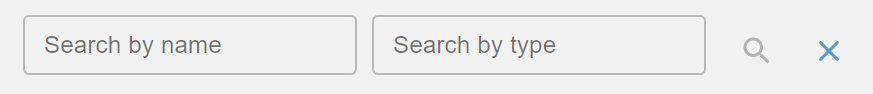
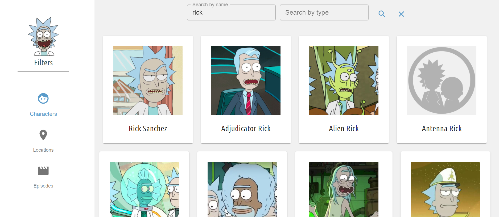

---

---

Hi there, I’m Marina 👋

<h1 id="this-is-an-awesome-rick--morty-searcher">This is an awesome Rick &amp; Morty Searcher</h1>

You can find any interesting information about the show <strong>Rick &amp; Morty</strong> using one of the three filters provided. One for characters, one for locations and another for episodes. Find anything you want by typing in the name or type.

🌹 <strong>There are two ways you can get to know this app better:</strong>

<ul>
<li>

Check out the online demo in <a href="https://reactjs-challenge-marina.web.app/">here</a>

</li>
<li>

Clone the project in order to run it locally by following me with the next steps!

</li>
</ul>
 

<strong>Ready? Fire!</strong> 🚀

 
<ol>
<li>

<strong>Clone</strong> the projct by entering the next command in your <code>command shell</code> <em>(make sure you have <a href="https://git-scm.com/downloads">git</a> intalled in your computer)</em> and then press <strong>Enter</strong>

<code>$ git clone https://github.com/marinawangmw/reactjs-challenge.git</code>

</li>
<li>

Step into the folder cloned

<code>cd reactjs-challenge</code>

</li>
<li>

Check if you have <a href="https://nodejs.org/en/download/">node</a> installed in your computer with <code>node -v</code> 

</li>
<li>

<strong>Start</strong> the project with <code>npm start</code> 

</li>
<li>

<strong>And it is running~ Easy right?</strong> 😉 

</li>
</ol>
 
<h1 id="🕵️‍♀️-what-you-can-do-with-this-app">🕵️‍♀️ What you can do with this app</h1>

<strong>Sidebar :</strong>

You can find the filters for the search in the sidebar. 
<em>(🐤 A little birdie says try what happens when you click on Rick smiling face)</em>

 
 

<strong>Search box :</strong>

You can search by typing the name or the type (type is only available for characters and locations filters). Search by clicking on the <strong>loop icon</strong> or by hitting <strong>Enter</strong>.

Clear text entered in the searchbox and all the data you got in previous searches by clicking on the <strong>cross icon</strong>.

 
  
<strong>Gallery Section :</strong> 
Any results that match the search will be shown in here. Press any card for more detailed information. 

 

<strong>Have fun!</strong> 🥳

